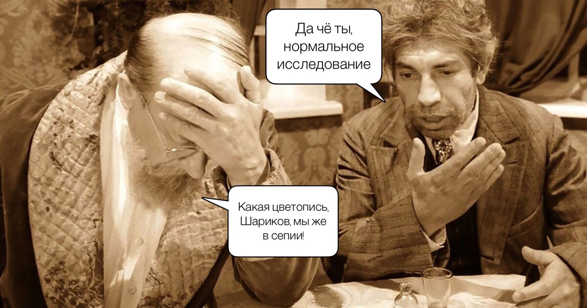
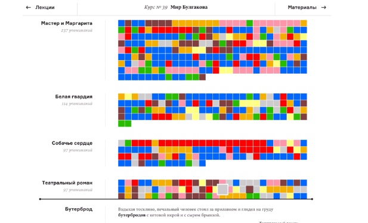
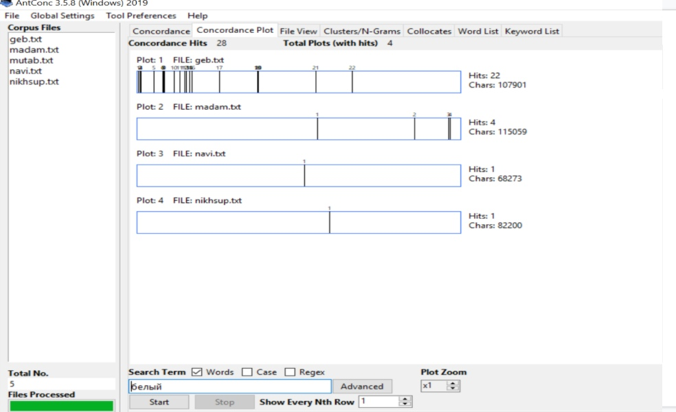
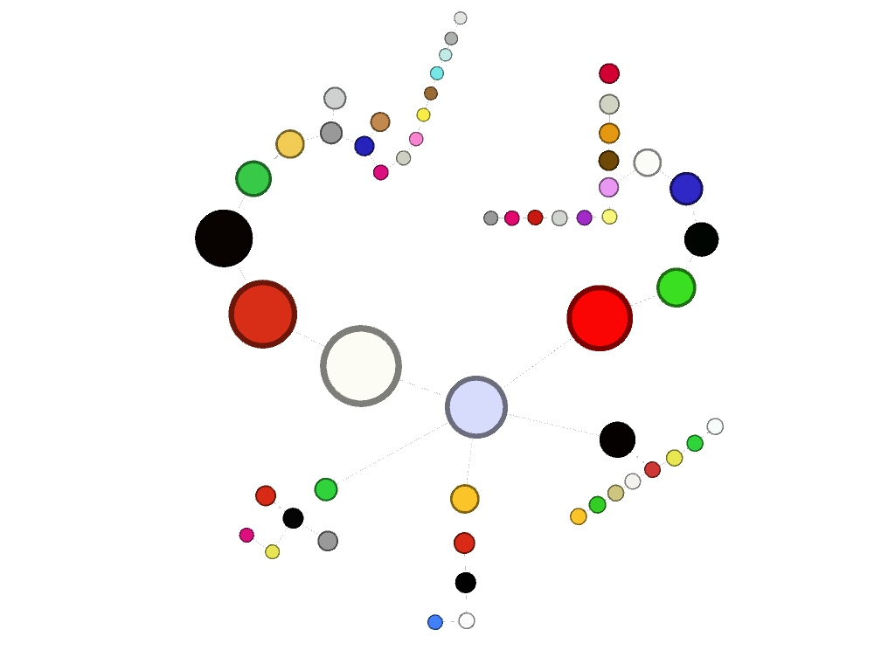
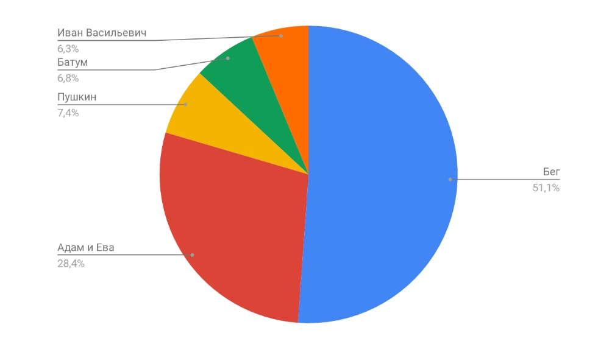
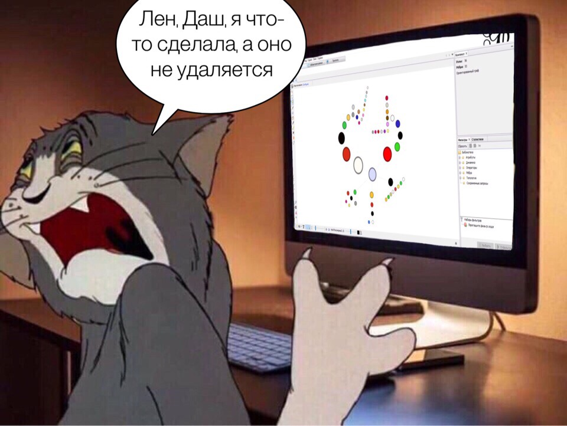

# Особенности цветописи в пьесах М. А. Булгакова
# Сайт тутъ:
https://elenaminasyants.github.io/project.github.io/
# Цель
*Рассмотреть пьесы М. А. Булгакова и постараться выявить некоторые закономерности в цветовой поэтике. Были использованы пять пьес:
"Бег", "Адам и Ева", "Батум", "Пушкин" и "Иван Васильевич"*

 

# Наши методы: 
+ Сначала мы сделали выборку текстов, затем лемматизировали их.
+ Следующим шагом стало примение Antconc, с помощью которого нам удалось выявить все цветовые маркеры в пьесах.
+ В конце мы воспользовались Gephi, чтобы представить визуализацию проделанной работы.

# Инструменты:
+ Mystem
+ AntConc
+ Gephi

# *Вдохновение* 
*На Arzamas есть исследование, посвященное анализу вкуса и цвета в прозе Булгакова. Мы же решили проанализировать пьесы.*

 

# AntConc and Co
*AntConc:*

С помощью AntConc мы отобрали все цвета, которые встречаются в текстах. 

*Gephi:*

 

На визуализации представлены все цвета, которые нам удалось найти. Обращаем внимание на то, что чаще употребляются основные цвета, а оттенки – гораздо реже. Частое употребление маркеров "красный" и "белый" связано с контекстом эпохи, а именно с Гражданской войной.

*Диаграмма:*

 

На схеме отлично видно закономерности, которые прослеживаются в цветовой поэтике Булгакова. Чем больше объём текста, тем больше в нём цветовых маркеров. 
Данная диаграмма отражает выведенную нами зависимость числа маркеров от объёма текста. В пьесе "Бег" 90 употреблений цветов, а в "Иване Васильевиче" всего лишь 11.

# Выводы:

В пьесах гораздо меньше цветовых маркеров, нежели в прозе, так как пьесы содержат меньше описательного элемента. Тем не менее, в результате исследования были выявлены не только цвета основной палитры, но и их оттенки. Объем пьес закономерно влияет на количество цветовых маркеров в них.

*А в конце наш мем:*

 

